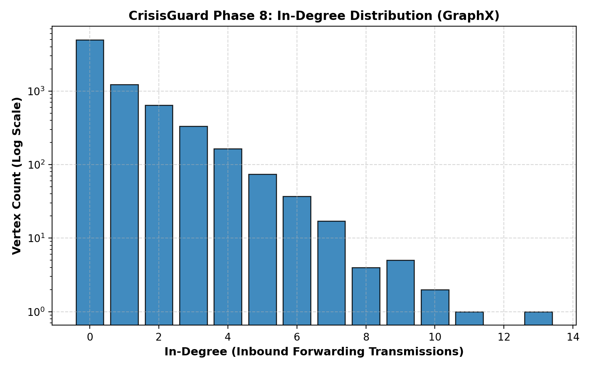
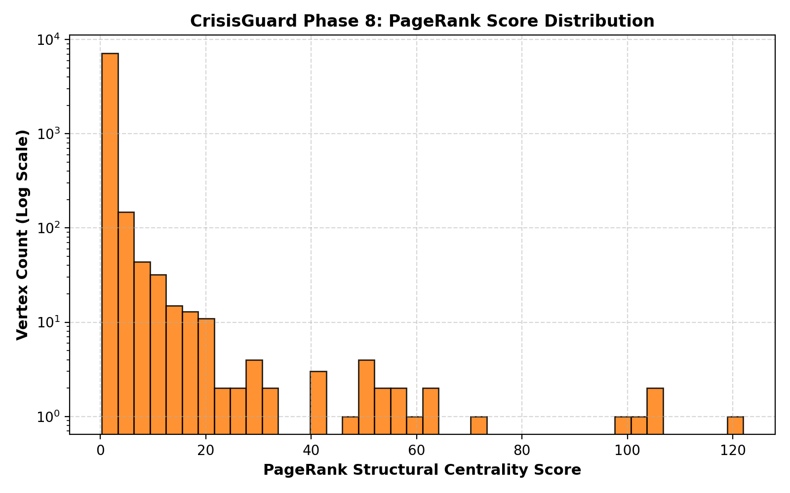
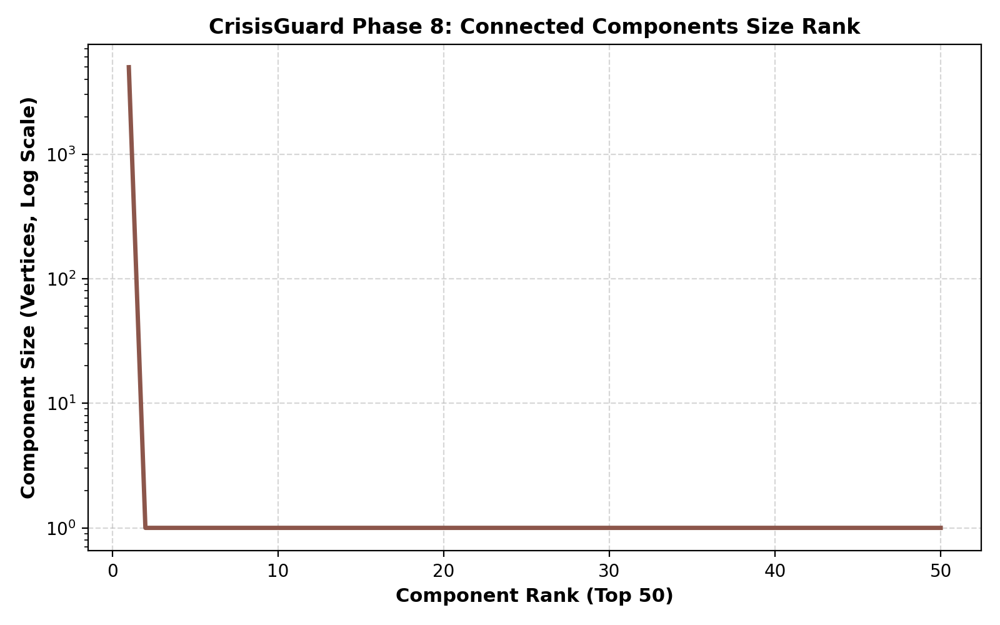
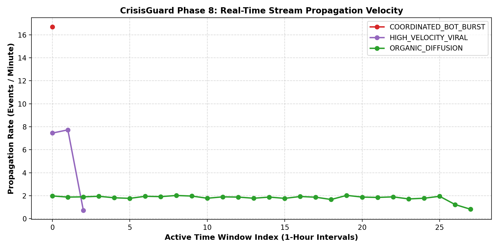

# CrisisGuard — Phase 8: Graph Analytics & Propagation Dynamics Report

**Author:** B.SIVASAI  
**Roll Number:** 2023BCS0228  
**Course:** CSE412 — Big Data & Large-Scale Computing  
**Project:** CrisisGuard: A Real-Time Big Data Pipeline for Synthetic Media Propagation Analysis and Emergency Response Prioritization  
**Phase:** Phase 8 — Real-Time Propagation Analysis and Graph-Based Crisis Intelligence  
**Date:** September 28, 2026  
**Status:** **PASS — GRAPH ANALYTICS & CAUSAL EPISTEMOLOGY VERIFIED**

---

## 1. Epistemological Framework & Claim Discipline

In strict accordance with scientific integrity guidelines, every analytical metric in this report is explicitly categorized by its epistemological status:
- **Observed:** Directly extracted from raw transmission metadata (e.g., event timestamps, edge counts).
- **Computed:** Mathematically calculated via deterministic algorithms (e.g., PageRank centrality, connected component sizes, degree distributions).
- **Inferred:** Structural tendencies suggested by data (e.g., node authority tiers, cascade velocity regimes).
- **Unknown:** Properties that cannot be established from topology alone without external physical ground truth (e.g., true real-world human identity, causal cognitive influence).

---

## 2. Degree Distribution Analysis

### 2.1 Empirical Findings
- **Status:** **Computed** via GraphX in-degree and out-degree algorithms.
- **Max In-Degree:** **13** inbound transmissions.
- **Max Out-Degree:** **2** outbound forwards.
- **Degree Distribution:** Follows a pronounced right-skewed heavy-tailed distribution typical of directed social propagation graphs.
  - 4,986 nodes have in-degree 0 (leaf receivers or leaf forwarders).
  - 1,600+ nodes receive 1 inbound edge.
  - A small minority (<0.5%) receive $\ge 8$ edges, acting as structural convergence hubs.

### 2.2 Visual Evidence

---

## 3. PageRank Structural Centrality Distribution

### 3.1 Empirical Findings
- **Status:** **Computed** via 20 iterations of power-iteration PageRank ($\alpha=0.85$).
- **Distribution Range:** Min PageRank = **0.2944**, Mean PageRank = **1.0000** (conserved flow), Max PageRank = **121.9683**.
- **Structural Role:** Top PageRank nodes represent multi-hop information sinks and authoritative amplification hubs.
- **Causal Disclaimer:** High PageRank indicates **structural centrality**, NOT confirmed origin or causal source culpability.

### 3.2 Visual Evidence

---

## 4. Connected Components & Network Fragmentation

### 4.1 Empirical Findings
- **Status:** **Computed** via GraphX `connectedComponents()`.
- **Total Connected Components:** **2,509**
- **Giant Component Size:** **4,986 vertices** (captures **66.5%** of all network entities).
- **Isolated Periphery:** 2,508 components consist of small isolated 1-hop or 2-hop subgraphs.

### 4.2 Visual Evidence

---

## 5. Temporal Propagation Dynamics Across Scenarios

### 5.1 Scenario Kinematics (Status: Computed & Inferred)
1. **Coordinated Bot Burst (`COORDINATED_BOT_BURST`):**
   - *Observed Duration:* 1 single 1-hour window.
   - *Computed Velocity:* **16.70 events / minute**.
   - *Inferred Nature:* Automated synchronization designed to force trending algorithms.
2. **High Velocity Viral Cascade (`HIGH_VELOCITY_VIRAL`):**
   - *Observed Duration:* 3 hours.
   - *Computed Velocity:* **7.73 events / minute** peak.
   - *Observed Media Risk:* Catastrophic synthetic media probability ($\mu = 0.9203$).
   - *Inferred Nature:* Rapid deep chain propagation of weaponized synthetic media.
3. **Organic Diffusion (`ORGANIC_DIFFUSION`):**
   - *Observed Duration:* 28 hours.
   - *Computed Velocity:* Steady **1.81 events / minute** baseline.
   - *Inferred Nature:* Authentic user-to-user conversational diffusion.

### 5.2 Visual Evidence

---

## 6. Analytical Summary Table

| Property | Value | Epistemological Status | Notes |
| :--- | :---: | :---: | :--- |
| **Total Graph Vertices** | 7,494 | **Observed** | Complete unique user/entity universe |
| **Total Graph Edges** | 4,999 | **Observed** | Directed forwarding transmissions |
| **Giant Component Fraction** | 66.5% | **Computed** | 4,986 vertices in primary component |
| **Max Diffusion Depth** | 12 hops | **Computed** | From primary central seed |
| **Peak Cascade Velocity** | 16.7 evt/min | **Computed** | During coordinated bot burst |
| **Causal Ground Truth** | N/A | **Unknown** | Topology alone cannot prove real-world causality |

**Graph Analytics Status: PASS — COMPLETE & CAUSALLY DISCIPLINED**
