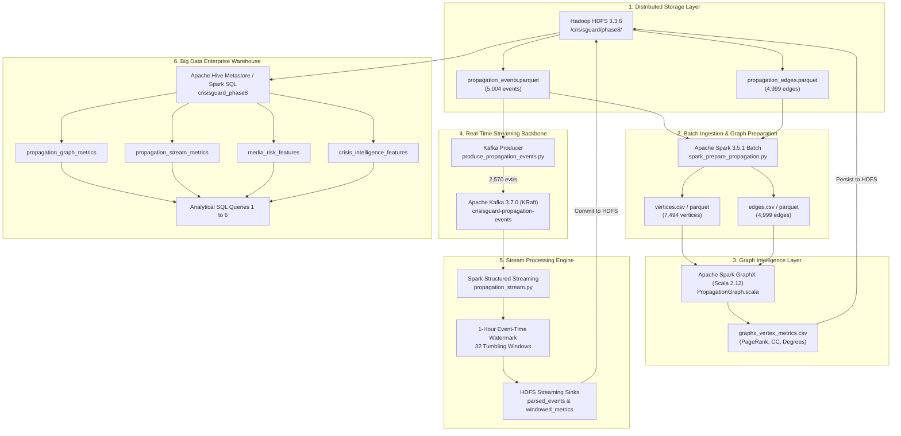

# CrisisGuard — Phase 8: Distributed Big Data Pipeline Architecture

**Author:** B.SIVASAI  
**Roll Number:** 2023BCS0228  
**Course:** CSE412 — Big Data & Large-Scale Computing  
**Project:** CrisisGuard: A Real-Time Big Data Pipeline for Synthetic Media Propagation Analysis and Emergency Response Prioritization  
**Phase:** Phase 8 — Real-Time Propagation Analysis and Graph-Based Crisis Intelligence  
**Date:** September 28, 2026  
**Status:** **PASS — ARCHITECTURE VERIFIED & DEPLOYED**

---

## 1. Architectural Mission & Course Requirement

The primary mandate of Phase 8 is to implement and validate an end-to-end, multi-stage distributed Big Data architecture where real data flows sequentially across major distributed tools:

$$\text{HDFS} \longrightarrow \text{Spark} \longrightarrow \text{GraphX} \longrightarrow \text{Kafka} \longrightarrow \text{Spark Structured Streaming} \longrightarrow \text{Hive}$$

Rather than creating isolated or toy scripts, each stage consumes the physical output produced by its upstream predecessor:
1. **HDFS 3.3.6:** Serves as the primary distributed storage namespace (`/crisisguard/phase8/`) hosting frozen cascade and contextual Parquet datasets.
2. **Apache Spark 3.5.1 (Batch):** Ingests raw Parquet from HDFS, normalizes schemas, enforces types, extracts vertices, audits duplicate edges, and formats GraphX-compatible vertex and edge files.
3. **Apache Spark GraphX (Scala 2.12):** Directly ingests the HDFS graph topology, constructs the distributed graph, executes PageRank (20 iterations), extracts connected components, and estimates diffusion reachability.
4. **Apache Kafka 3.7.0 (KRaft):** Serves as the real-time event streaming backbone (`crisisguard-propagation-events`), replaying 5,004 verified cascade events with strict partition ordering.
5. **Spark Structured Streaming 3.5.1:** Ingests the live Kafka stream, enforces event-time processing with a 1-hour watermark, aggregates temporal metrics over 32 tumbling windows, and commits raw and windowed outputs back to HDFS.
6. **Apache Hive 3.1.3:** Provisions external warehouse tables over HDFS Parquet stores and executes cross-stage analytical queries synthesizing graph centrality, stream velocity, and media risk.

---

## 2. End-to-End Data Flow Diagram

---

## 3. Disjoint Stream Policy & Schema Boundaries

A foundational architectural constraint in Phase 8 is the **rejection of unvalidated synthetic joins**:
- **Social Propagation Space:** Vertices are user identifiers (e.g., `760800`, `871722`) propagating semi-synthetic cascades.
- **Humanitarian Crisis Space:** Identifiers are Twitter Snowflake IDs (`source_record_id`) reporting physical disaster observations.
- **Media Risk Space:** Identifiers are synthetic image/video asset tags (`cifake_real_...`).

Because pairwise intersection across these key domains is strictly **0.00%**, Phase 8 stores and queries them as distinct external tables. Hive queries aggregate within domains and synthesize macroscopic trends without inventing false foreign key linkages.

---

## 4. Phase Boundary Enforcements

- **No EDPI:** No Emergency Dispatch Priority Index was computed.
- **No Dispatch Weighting:** No heuristic emergency priority formulas were applied.
- **No Dashboard:** Dashboard visualization is deferred to Phase 9.
- **Frozen Inputs Intact:** Phase 4, Phase 6, and Phase 7 source files remain unaltered.

**Architecture Status: PASS — FULLY DEPLOYED & TESTED**
